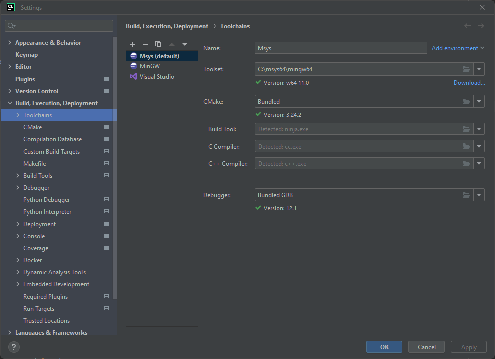
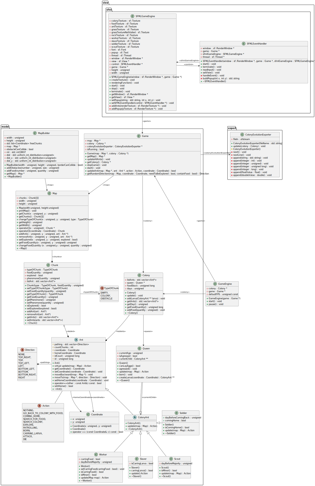

# Simulateur de colonie de fourmis
Crée par [Steenall](https://github.com/steenall) et [michelka05](https://github.com/michelka05)
## Information concernant ce projet

Ce projet a été crée dans le cadre d'un projet scolaire au sein de l'Ensicaen. Il s'agit d'une simulation de colonie de fourmi écrit en C++ à l'aide de la librairie SFML. Le but de ce projet n'était pas d'avoir un maximum des fonctionnalités demandés mais d'apprendre les différentes fonctionnalités offertes par le C++ (jusqu'a la norme C++14).

## Structure du projet
* diagrams
	* Le diagramme de classe écrit avec PlantUML
* include
	* Les fichiers d'entêtes du jeu
* resources
	* Les différentes images utilisés dans la simulation (sprite)
* src
	* Les fichiers sources en C++

## Installation des outils de compilation et de SFML

### Linux (apt et dnf)
Sur Ubuntu et Fedora, il faut installer la librairie SFML afin de pouvoir compiler le projet ainsi que le compilateur g++ et cmake
```bash
sudo apt install g++ cmake libsfml-dev
```
ou
```bash
sudo dnf install gcc-c++ cmake SFML
```


### Windows avec MSYS
Sur windows, il est possible d'utiliser un compilateur permettant d'installer des librairies tierces comme MSYS. Une fois MSYS installer, il faut taper cette commande dans le terminal de MSYS.
```bash
pacman -S mingw-w64-x86_64-sfml mingw-w64-ucrt-x86_64-sfml mingw-w64-clang-x86_64-sfml cmake gdb
```
Après cela, il est possible d'ajouter Msys comme compilateur en spécifiant le dossier où est installé MSYS comme dans la capture suivante sous CLion :

### Mac OS (non testé)
Pour installer la librairie SFML, il est possible d'utiliser Brew
```bash
brew install sfml
```

## Import dans CLion
Pour importer le projet, il faut juste ouvrir le projet et l'éxécuter, aucune autre action n'est nécéssaire.

## Compiler en ligne de commande
Dans le dossier, taper :
```bash
cmake .
```

## Liste des raccourcis clavier

|  Touches   |   Effet  |
| --- | --- |
|  + ou scroll de la molette vers le haut   |  Zoom   |
|  - ou scroll de la molette vers le bas   |  Dézoom   |
|  flèche gauche ou Q   |   Déplace la caméra vers la gauche  |
|  flèche droite ou D   |   Déplace la caméra vers la droite  |
|  flèche haut ou Z   |   Déplace la caméra vers le haut  |
|  flèche bas ou S   |   Déplace la caméra vers le bas  |

## Listes des macros
Les macros non cités ici sont calculés à partir des autres macros et ne nécéssite pas d'être modifié

|  Macro   |  Emplacement   |  Valeur par défaut   |   Description  |
| --- | --- | --- | --- |
|  DEFAULT_FILE_NAME_EXPORT   |  [ColonyEvolutionExporter.h](./include/export/ColonyEvolutionExporter.hpp)   |  colony_evolution_export.csv   |   Nom du fichier d'export  |
|  WIDTH   |  [Map.h](./include/model/Map.hpp)   |  101   |  Longueur du terrain   |
|  HEIGHT   |  [Map.h](./include/model/Map.hpp)   |   101  |   Hauteur du terrain  |
|  QUANTITY_OF_FOOD   |  [Map.h](./include/model/Map.hpp)   |  10   |  Quantité de nourriture par case de nourriture   |
|  NUMBER_OF_OBSTACLE_MULTIPLIER  |   [Map.h](./include/model/Map.hpp)  |  0.30   |   Pourcentage de cases qui sont des obstacles  |
|  NUMBER_OF_BABY_PER_ROUND  |   [Queen.h](./include/model/Queen.hpp)  |  0.2   |  Nombre d'enfant par tour  |
|  CAMERA_MOVE_OFFSET  |   [SFMLEventHandler.h](./include/view/SFMLEventHandler.h)  |  50   |  Définit la valeur pour le déplacement de la caméra (sur chaque coté)  |
|  SPRITE_SIZE  |   [SFMLGameEngine.h](./include/view/SFMLGameEngine.h)  |  30   |  Définit la taille des cases dans l'interface graphique de SFML |
|  DEFAULT_FPS  |   [GameEngine.h](./include/GameEngine.hpp)  |  60   |  Nombre de FPS par seconde (cette valeur n'est pas 100% exacte selon le système d'exploitation, voir la documentation de SFML). Il faut que la valeur soit au dessus de la macro UPDATE_PER_SECOND  |
|  UPDATE_PER_SECOND  |   [GameEngine.h](./include/GameEngine.hpp)  |  15   |  Nombre de tour pour chaque seconde. Cette valeur est utilisé selon le nombre de FPS maximum et peut ne pas être exacte si le jeu n'arrive pas à atteindre le nombre de FPS maximum  |
|  WINDOW_NAME  |   [GameEngine.h](./include/GameEngine.hpp)  |  Ant Colony Simulator   |  Le nom de la fenêtre  |

## Diagramme de classe



